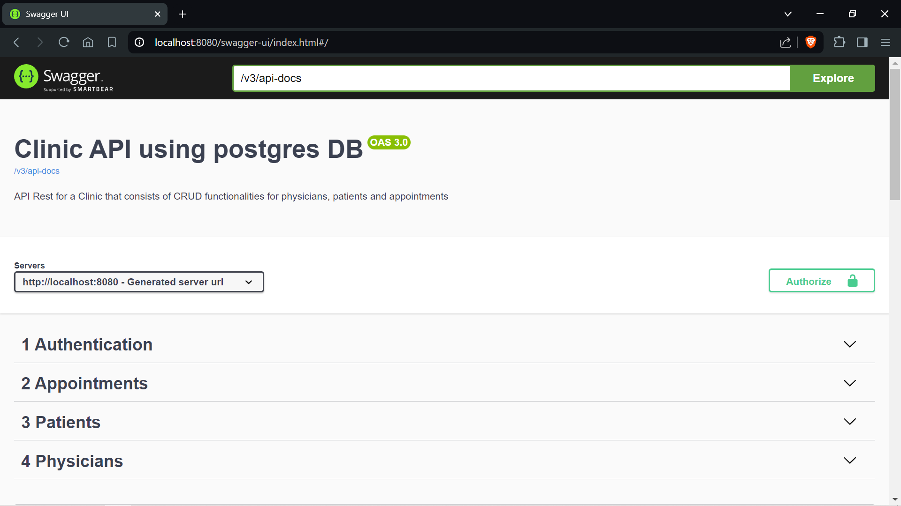
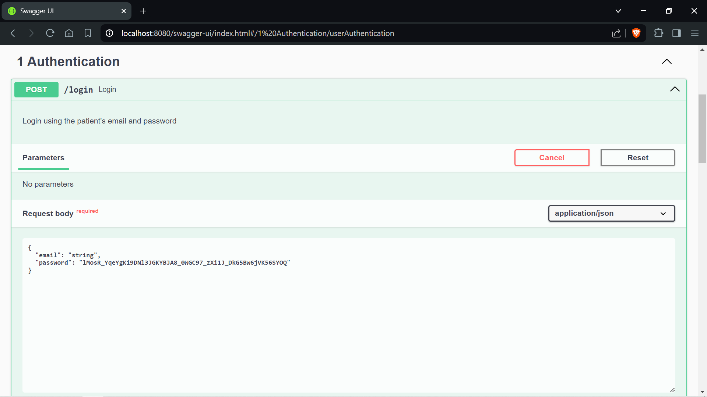
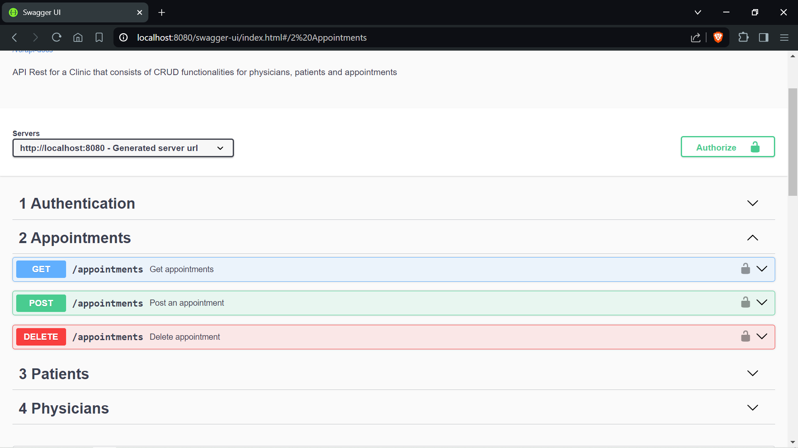
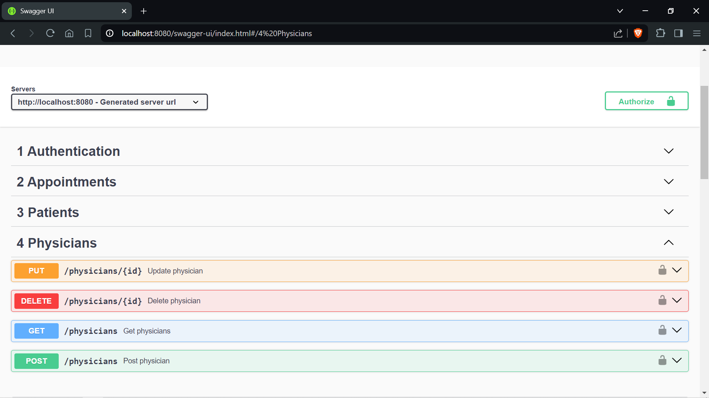

# CLINIC API REST Stateless

### Guide
The following guides illustrate how to use some features concretely:

Business rules:
* Clinic working hours are Mondays to Saturdays from 7am to 7pm.
* Appointments are booked not later than 30 minutes before the start of it.
* Patients are allowed to book 1 appointment per day.
* If the physician's ID is not known, providing a Specialty will make the system provide you a random available professional.

Authenticate using an email and a password. The password will be encrypted
using bcrypt and compared to the one stored in the postgres DB.

Then you can add, list and delete appointments:

Also register, update, list and delete patients from the database:

And as well with physicians:

